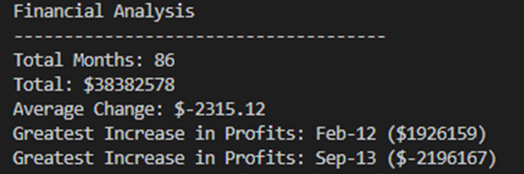

# Python Challenge

## Project Description
There were four sub projects that were undertaken wherein the requirements were to develop a suitable python script that would analyse data sets in the form of strings, as seen with the PyParagraph project, or to analyse numerical data sets as witnessed in the PyBank and PyPoll projects. A python script was also developed in which to reformat different columns within a csv document, for instances, changing the presentation of the dates from "-" between days, months and years to a format that seperates by using "/" as was understaken in the PyBoss project.

The resulting data analysis were exported into the relevant formats which can be found in the "Analysis" folder for the PyBank, PyPoll and PyParagraph Projects. As the PyBoss was involved in reformatting data sets, the "cleaned" data was rexported into a new folder that is entitled "Cleaned Data" and is available for viewing. 

## Outcomes for each project
A screen shot for each project has been provided below:

### PyBank Output onto the terminal

